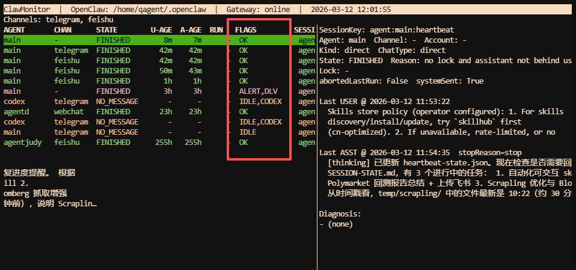
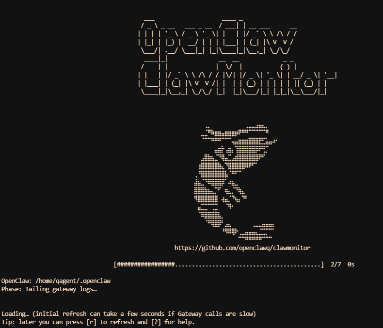

# ClawMonitor

English | [简体中文](README.zh-CN.md)





Keyboard-first **OpenClaw** monitor with:

- Per-session last inbound **user** message + last outbound **assistant** message (preview + timestamp)
- Per-model health probes (direct provider API and through OpenClaw itself)
- On-demand session history with task trajectory (`todo / doing / done`)
- Token visibility from local session snapshots plus Gateway `1d / 7d / 30d` usage windows
- Gateway service / cgroup health view with zombie-orphan-helper inspection and reclaim estimates
- Work state: WORKING / FINISHED / INTERRUPTED / NO_MESSAGE (+ NO_FEEDBACK alert)
- Long-run visibility via `*.jsonl.lock` (works even if Gateway is down)
- Optional Gateway log tail + channel runtime snapshot correlation (Feishu/Telegram-focused rules)
- Full-screen TUI with manual “nudge” (send a progress request via `chat.send`)

## Install (editable)

```bash
cd ~/program/clawmonitor
python3 -m pip install -e .
```

## Install (PyPI)

```bash
pip install clawmonitor
```

## Run

```bash
clawmonitor init
clawmonitor tui
```

Other commands:

```bash
clawmonitor snapshot --format json
clawmonitor snapshot --format md
clawmonitor nudge --session-key 'agent:main:main' --template progress
clawmonitor nudge --session-key 'agent:main:main' --template continue
clawmonitor push --session-key 'agent:main:main' --dry-run
clawmonitor status
clawmonitor status --detail
clawmonitor status --format json
clawmonitor status --format md
clawmonitor status --format md --detail
clawmonitor cron
clawmonitor models
clawmonitor models --mode direct --format json
clawmonitor models --mode openclaw --timeout 15
clawmonitor tree
clawmonitor report --session-key 'agent:main:main' --format both
clawmonitor watch --interval 1
```

## Configuration

Default config path:

- `~/.config/clawmonitor/config.toml`

Example config is in `config.example.toml`.

### Optional labels

You can assign human-friendly names to long session keys (e.g. Feishu `ou_...`).
See the `[labels]` section in `config.example.toml`.

Runtime data (NOT stored in this repo):

- Logs: `~/.local/state/clawmonitor/events.jsonl`
- Reports: `~/.local/state/clawmonitor/reports/`
- Cache: `~/.cache/clawmonitor/`

## Keys (TUI)

- `↑/↓`: move selection
- `PgUp/PgDn`: page up / down
- `g` / `G`: jump to top / bottom
- `Enter`: nudge selected session (choose template)
- `?`: show help overlay
- `v`: cycle sessions / models / system views
- `s`: jump directly to system view
- `h`: toggle status / history on the right
- `u`: cycle token windows (`now` / `1d` / `7d` / `30d`)
- `x`: focus filter (hide stale sessions)
- `t`: toggle tree view (group by agent)
- `c`: toggle cron jobs in tree view
- `R`: rename/label selected session (writes `[labels]` in config)
- `n`: toggle NODE label mode (channel:label)
- `l`: toggle related logs panel
- `d`: re-run diagnosis for selected session
- `e`: export a redacted report for selected session
- `z`: cycle pane widths
- `Z`: toggle fullscreen detail pane
- `o`: open operator note in system view
- `Esc`: reset to the default surface
- `r`: force refresh
- `f`: cycle refresh interval
- `q`: quit

Rows are color-coded when your terminal supports colors (`OK` green, `RUN` cyan, `IDLE` yellow, `ALERT` red).
In the details panel, `Task:` / `Thinking:` lines are highlighted (magenta when supported).

Model view notes:

- Model view is manual-refresh by design. Press `r` after switching with `v`.
- The top banner shows `WAITING`, `RUNNING`, `DONE`, or `ERROR`, so you can tell whether a probe run actually started.
- Each row shows the effective `agent + model` chain entry, including `primary` / `fallbackN` roles.
- ClawMonitor probes both paths when enabled:
  - Direct provider/API path (`--mode direct` or `both`)
  - OpenClaw execution path via temporary probe sessions (`--mode openclaw` or `both`)
- Supported direct transports today: `openai-completions`, `openai-responses`, `anthropic-messages`

Session/token/system notes:

- History loading is on demand. In the session view, press `h` and then `r` to read cached task history for the selected session.
- Token `1d / 7d / 30d` windows are loaded from Gateway on demand and then cached in the TUI.
- System view is read-only by design: it summarizes service state, helper buildup, zombies/orphans, and reclaimable memory estimates without killing anything.

See `docs/model-monitor.md` for the probe model, classifications, and UI behavior.
See `docs/system-monitor.md` and `docs/system-view-guide.zh-CN.md` for the new system view.

## Telegram note: ACP “thread bindings”

OpenClaw can route a Telegram chat to a different session key via local *thread bindings*.
This may make it look like your “main” session stopped receiving messages.

ClawMonitor detects this and flags it:

- `BOUND_OTHER` in `clawmonitor status`
- `BIND` in the TUI list

Relevant files/settings:

- Thread bindings: `~/.openclaw/telegram/thread-bindings-default.json`
- Config toggle: `~/.openclaw/openclaw.json` → `channels.telegram.threadBindings.spawnAcpSessions`

## First run

If no config file exists, most commands will offer to run the init wizard (interactive terminals only).

See `docs/launch-post.md` for a longer intro.

## Notes

- ClawMonitor never prints or writes OpenClaw secrets. It avoids dumping `openclaw.json` and redacts suspicious token-like strings in logs/reports.
- If Gateway is unreachable, ClawMonitor still works in offline mode (sessions/transcripts/locks/delivery-queue) but disables log tail + nudge.
- If your terminal window is narrow, `clawmonitor tui` may hide the details panel; use `clawmonitor status` as a stable fallback.
- For ClawHub import, see `docs/clawhub-skill.md` and `skills/claw-monitor/SKILL.md`.

See `CONTRIBUTORS.md` for acknowledgements.
